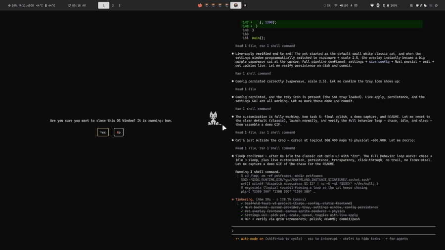
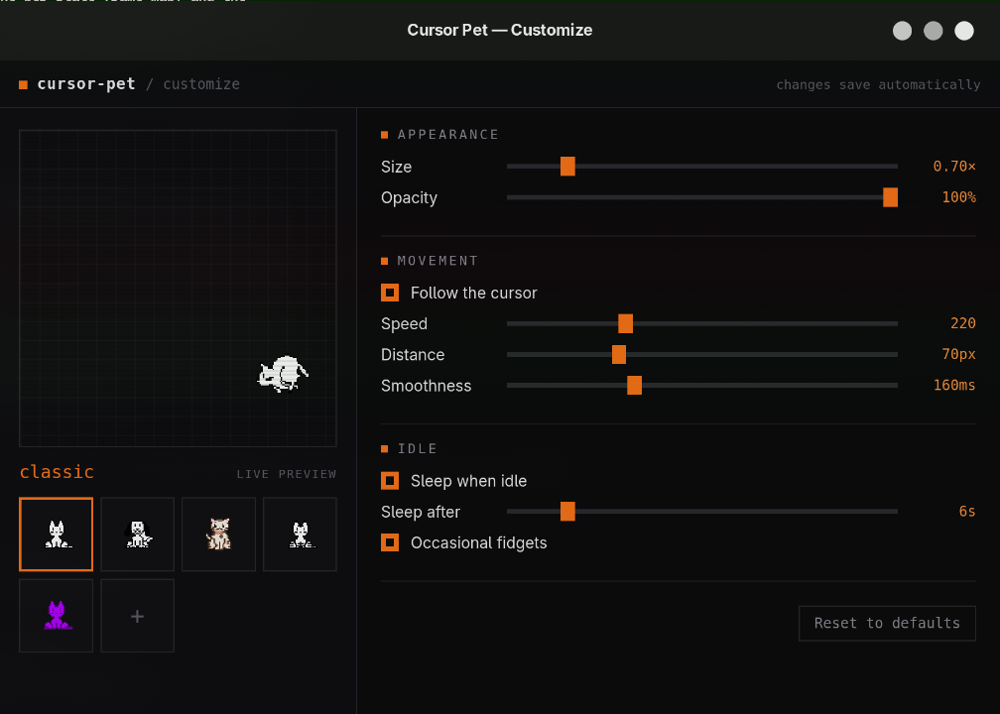
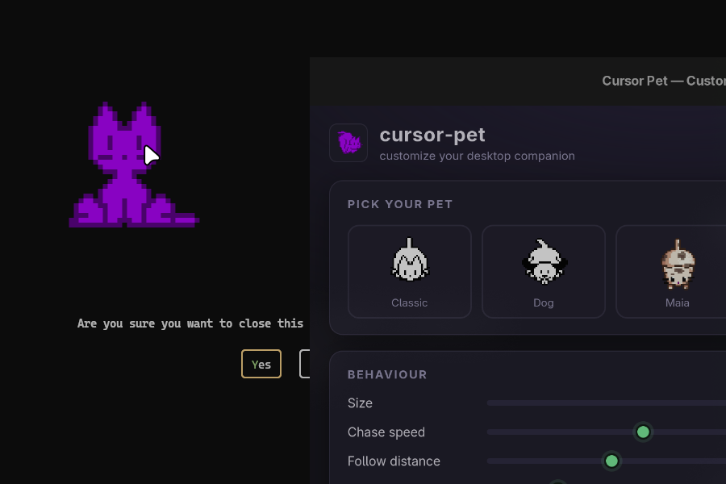

# 🐾 cursor-pet

A tiny, customizable **desktop pet** that lives on your screen and chases your
cursor — a retro pixel cat (or dog!) that walks toward the mouse, sits and idles
when it catches up, and curls up to sleep when you leave it alone.

Built with **Rust + Tauri v2** for a small memory/CPU footprint. The pet and its
customization GUI are one process: the settings window is only created when you
open it and destroyed when you close it, so nothing heavy sits idle in the
background.



---

## Features

- **Cursor chasing** — the pet walks toward your cursor with 8-directional
  animated sprites, then settles into a calm idle when it arrives.
- **Non-intrusive by design** — the overlay is fully **click-through** and
  **never steals focus**, so it lives above your work without ever getting in
  the way. No blur, no dimming, no window-layout disruption.
- **Idle & sleep** — the pet does small, non-distracting idle fidgets and falls
  asleep (💤) after a while of inactivity, waking up the moment you move.
- **5 retro pets + your own** — `classic` cat, `dog`, `maia` (tabby), `tora`
  (tiger tabby), and `vaporwave`, plus any sprite sheet you import. Swappable live.
- **Customization GUI** — pick your pet, set size, opacity, chase speed, follow
  distance, follow smoothness, and sleep timing, toggle following/sleeping/fidgets.
  **Every change applies instantly** to the running pet and is saved to disk.
- **System tray** — Customize…, Show / Hide Pet, and Quit.

## Screenshots

The customization GUI:



The pet, following the cursor over whatever's on screen (here mid-customization,
scaled up to the `vaporwave` cat):



## Requirements

- A **Wayland** compositor. Developed and tested on **Hyprland** (uses Hyprland's
  IPC for the global cursor position and for window rules). See
  [Portability](#portability) for other setups.
- **Rust** (1.77+), and system webkit2gtk (`webkit2gtk-4.1`) + GTK dev libraries
  that Tauri needs.

## Build & run

No Node toolchain or Tauri CLI is required — the frontend is plain static
HTML/CSS/JS embedded at compile time, so a plain `cargo` build produces the app:

```bash
cd src-tauri
cargo build --release
./target/release/cursor-pet
```

For development:

```bash
cd src-tauri
cargo run
```

Open the customization window from the **tray icon** (left-click, or right-click →
_Customize…_).

## How it works

```
┌──────────────────────── one process ────────────────────────┐
│                                                              │
│  Rust backend                        Frontend (webview)      │
│  ────────────                        ─────────────────       │
│  • reads global cursor from the      • pet.html — a full-     │
│    Hyprland IPC socket (cheap,          screen transparent,   │
│    no process spawning), emits          click-through canvas  │
│    it to the overlay only on           • neko.js — sprite     │
│    change                               sheet map + a chase/  │
│  • system tray + config JSON            idle/sleep state      │
│    (load/save)                          machine (physics)     │
│  • creates the settings window        • settings.html — the   │
│    on demand, destroys on close         customization GUI     │
│                                                              │
└──────────────────────────────────────────────────────────────┘
```

- The **overlay** is a transparent, always-on-top, click-through window covering
  the whole screen. The sprite is drawn on a single static canvas that is cleared
  and repainted each frame (moving a small transformed element instead leaves a
  trail on webkit's transparent surface).
- The backend streams the **global cursor position** to the overlay; the canvas
  runs the physics and animation. When the cursor is still, no events are sent —
  an idle desktop costs effectively nothing.
- Settings changes call a `save_config` command that persists the config and
  emits `config-changed`; the overlay applies it live.

### Sprites

The pets use the classic **oneko** sprite sheets — an 8×4 grid of 32px tiles with
idle, alert, sleep, scratch, and 8 walking directions — which is exactly the
layout designed for a cursor-chasing pet. Sheets live in `src/sprites/`.

## Footprint

Measured on Linux (release build), idle, overlay only — real **PSS** (shared
memory counted once, not the inflated RSS number):

| Process | Memory (PSS) |
| --- | --- |
| `cursor-pet` (main) | ~113 MB |
| WebKitWebProcess (overlay) | ~121 MB |
| WebKitNetworkProcess | ~39 MB |
| **Total, idle** | **~274 MB** |

That's the WebKit floor for a webview overlay — roughly half of an equivalent
Electron app. The **settings window is created on demand and destroyed on
close**, so it costs nothing while you're not customizing. Idle CPU is
effectively zero: the backend emits a cursor event only when the pointer
actually moves, and the canvas repaints only when the sprite frame or position
changes. The release binary is ~4 MB.

## Configuration

The config is stored at `~/.config/dev.crosmos.cursorpet/config.json`:

| Field | Meaning |
| --- | --- |
| `pet` | sprite sheet: a built-in (`classic`/`dog`/`maia`/`tora`/`vaporwave`) or a custom pet id |
| `scale` | rendered size multiplier |
| `opacity` | sprite opacity, 0–1 |
| `speed` | chase speed (logical px/s) |
| `follow_gap` | distance from the cursor at which the pet stops |
| `reaction` | follow smoothing in seconds — higher is calmer and ignores small jitters |
| `follow` | whether the pet chases the cursor |
| `sleep_enabled` | whether the pet sleeps when idle |
| `idle_before_sleep` | seconds of idle before sleeping |
| `fidget_enabled` | whether the pet does occasional idle fidgets |

Values are clamped to sane ranges on load, so a hand-edited config can't break
the pet.

## Custom pets

Click the **+** tile in the settings window to import your own sprite sheet — an
8×4 grid of 32px tiles in the oneko layout (≥256×128, dimensions multiple of 32).
It's copied into the app data dir and appears alongside the built-ins; the **×**
on a custom swatch removes it.

A custom pet can ship an optional **manifest** (`<sheet>.json` next to the PNG at
import time) to override the tile size, the per-state frame map, and the
walk/sleep animation speed — so a sheet with a different layout still animates
correctly. Any omitted state falls back to the default oneko frames. See
[`docs/example-pet-manifest.json`](docs/example-pet-manifest.json).

## Platform support

cursor-pet is written to run on Linux, Windows, and macOS. The platform-specific
bits (global cursor + overlay placement) live behind a small abstraction
(`src-tauri/src/cursor.rs` → `CursorSource`), so the rest of the app is shared.

| Platform | Status | Global cursor | Overlay |
| --- | --- | --- | --- |
| **Linux / Hyprland** | ✅ tested | Hyprland IPC (`cursorpos`, logical coords) | Hyprland window rules (float/pin/no-blur/no-focus) + native Wayland |
| **Windows** | ⚠️ implemented, needs testing | `device_query` (`GetCursorPos`) | native always-on-top transparent click-through window sized to the monitor |
| **macOS** | ⚠️ implemented, needs testing | `device_query` (Core Graphics) | same, with `macOSPrivateApi` for the transparent window |
| **Linux / other WMs** | partial | `device_query` (needs X11 / XWayland) | native flags; window rules are Hyprland-only |

Per-OS requirements:

- **Windows** — no extra setup; ships as a normal `.exe`. Build needs the MSVC
  or GNU toolchain.
- **macOS** — the app needs **Accessibility** permission (System Settings →
  Privacy & Security → Accessibility) for `device_query` to read the global
  cursor. Transparent windows require `macOSPrivateApi` (already enabled), which
  means it can't ship on the Mac App Store — fine for a personal/desktop tool.
- **Linux (non-Hyprland)** — `device_query` reads the pointer via X11, so it
  works on X11 sessions and under XWayland. A pure-Wayland session without
  XWayland has no portable global-cursor API and isn't supported.

Multi-monitor and fractional scaling beyond the primary output are known
follow-ups on every platform.

## Credits

- Sprite sheets from the **oneko** project (the classic cursor-chasing neko),
  bundled via [`kyrie25/spicetify-oneko`](https://github.com/kyrie25/spicetify-oneko);
  original oneko.js by [`adryd325`](https://github.com/adryd325/oneko.js).
- Built with [Tauri](https://tauri.app).
